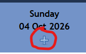

- [Back to **Admin Help**](../../admin/)
- [Previous: **Rotas**](../../admin/rotas/)
- [Next: **Closures**](../../admin/closures/)

**Rota Rules** set restrictions on which volunteers can sign up to shifts on a Rota. **Shifts** is used to create and edit Shifts.

In general, try to set as few Rota Rules as possible. Shifts have a defined size (min and max). it is not usually necessary to limit the number of volunteers who can sign up for a shift.

## Rota Rules

In order to edit Rota Rules you first need to pick the Rota to which you want the rules to apply. This will then bring up the Rules page for the appropriate Rota. Existing Rules for that Rota are shown at the top of the page, and additional Rules which have not yet been put in force are shown below the `New Rule` heading. To create a new Rule, select the `Create` button beside the Rule listing. To Edit an existing Rule, select the appropriate `Edit` button. Each Rule can be customised to better reflect the policies of your organisation. The following Rules are available:

#### Signup Window Rule

The signup window rule controls how far in advance volunteers can sign up to shifts.

#### Availability Override Rule

This is primarily for backwards compatibility. You probably want to allow volunteers to override their own unavailability.

#### Pullout Rule

The pullout rule determines whether or not volunteers can pull themselves out of shifts, and (optionally) how many days notice they must give to do so.

#### Undo Rule

The undo rule states whether or not a volunteer can undo an accidental shift signup, and how long they have to do so.

#### Swap Rule

The Swap Rule determines whether volunteers can request another volunteer take over their shift and how far in advance they can do so.

#### Required Role Rule

The Required Role Rule specifies that volunteers must have this role to cover a shift on this rota. It is not often necessary because you can restrict who can sign up for shifts using rota permissions.

#### Golden Rule

[alert\_box type="info" class="corners"]The 'Golden Rule' is that Admins and Rota Managers can always bend the rules.[/alert\_box]

#### Required Role Rule

This rule specifies whether volunteers must have a specific role in order to be sign up to shifts on this rota.

[alert\_box type="info" class="corners"]It is usually preferable to control who can sign up for shifts via rota permissions - though this is not always the case.[/alert\_box]

#### Exclusivity Rule

Prevents a volunteer from signing up to a shift on this rota if they're signed up to a shift at the same time in a different rota.

#### Min/Max Rule

Limits the number of volunteers with a specified role that can be signed up for a shift and also determines whether volunteers with a particular role consume a slot on that shift. For example, you might want to specify 'no more than one volunteer with the Newbie role on a shift'.

[alert\_box type="info" class="corners"]It is not necessary to reinforce the limits defined by the size of the shift. For example, if the shift allows two volunteers to sign up, you don't need to set a Min/Max rule to limit the number of volunteers to two. You can override the size of the shift.[/alert\_box]

#### Minimum Time Rule

Defines the minimum time that volunteers must leave between shifts - possibly on multiple rotas.

## Shifts

The Shifts tool used to control the shifts that volunteers in your organisation can staff. It is usually better to access these functions via the '+' sign under the date on the rota.

#### Adding a shift

On the rota, find the date on which the change is to occur, or begin, on the Rota. From there, select any shift and use the `“As an Administrator"` tab in the popup to Add the shift. On the `Add a Shift` page, use the dropdown to pick the `Rota` you want to add the shift to, as well as defining the shift `Start date/time` and its `Duration`. For an all-day shift, use the `All day?` checkbox instead of defining a Duration. Fill the Start and End times, if appropriate

[alert\_box type=”info” class=”corners] An all day shift will automatically have a duration of 24 hours, and will not have a start time. All day shifts appear at the top of the rota[/alert\_box]

You can define the minimum and maximum number of volunteers that will be allowed on the shift. If Shift Titles are enabled, you will also be asked to enter a title for the shift. You can use this to give your volunteers more details about this shift. If Shift Reminders are enabled you can say whether you want reminders to be sent for this shift and how far in advance they should be sent. Select how often you want the shift to reoccur:

| **Reccurance** | **Explanation** |
| **One-off** | This shift will only happen once. |
| **Weekly** | This shift will happen at the same time every week from now on. |
| **Fortnightly** | This shift will happen at the same time every other week from now on. |
| **X of every month** | This shift will happen on the same numerical day of every month from now on. |
| **X X of every month** | _for example the 3rd Saturday of every month_ This shift will happen on the same day of the same numerical week every month from now on. |
| **Every ... weeks** | _This shift will happen at the same time every X weeks._ You are able to set how many weeks you wish to have between shifts. |

When you’re happy with your settings, select `Create` to save the Shift in the Rota.

**Longer Shifts**

It is possible to create Shifts that last longer than one day. These can last up to seven days. To create one, select a future date within seven days of the start of the shift. Multiple continuation shifts will be displayed on the rota.

#### Copy or Move Shifts

Allows shifts or blocks of shifts to be copied or moved.

[alert\_box type="alert"] **Take Care:** It is possible to make a big mess if you get this command wrong. There is no Undo available![/alert\_box]

Select the rota and times for the shifts you want to Move or Copy.

Select the rota and start time for where they should be copied to.

[alert\_box type="info" class="corners"]All the shifts will be moved in a block to the new start date and time.[/alert\_box]

Select whether the new shifts should recur weekly or fortnightly in perpetuity.

Select whether you want the original shifts to be retained or not.

Select whether any volunteers signed up to the first occurrence of the shift will be copied.

Select Apply.
