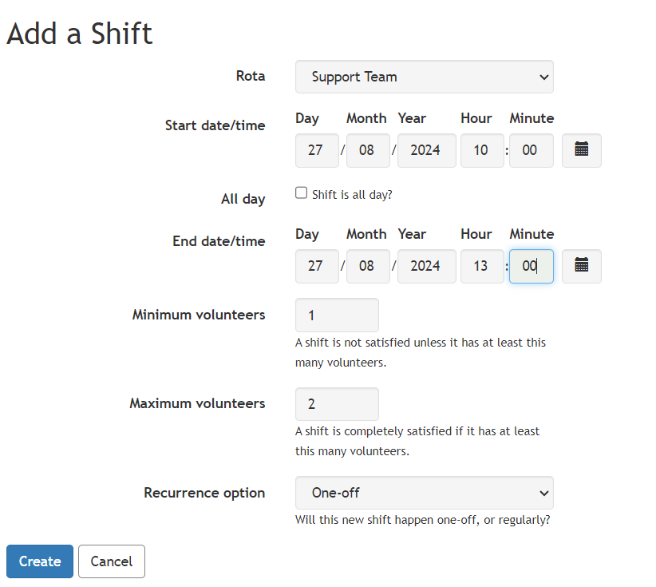

Adding a new shift, select the start and end times in the usual way. If you select All Day Shift, you need only select the start date (leave the time as specified) and the shift will run for 24 hours.

Select the minimum number of volunteers - this is generally the minimum number of volunteers for the shift to go ahead (it can be zero)

Select the maximum number of volunteers - this is generally the maximum number of people who can sign up for the shift - though there are exceptions (it should be greater than or equal to the minimum number of volunteers)

Depending on the options set for your account, you may be able to add a Shift Title and/or a Shift Reminder and how far in advance the reminder should be sent - these options can be enabled by your administrators in Admin \> Features.

Select whether you want the shift to repeat into the future. You can choose One-off, Weekly, Fortnightly (i.e. every other week), on the same date each month, the same day each month (e.g. first Sunday or similar), or every n weeks.

Select Create and you will be returned to the rota.
