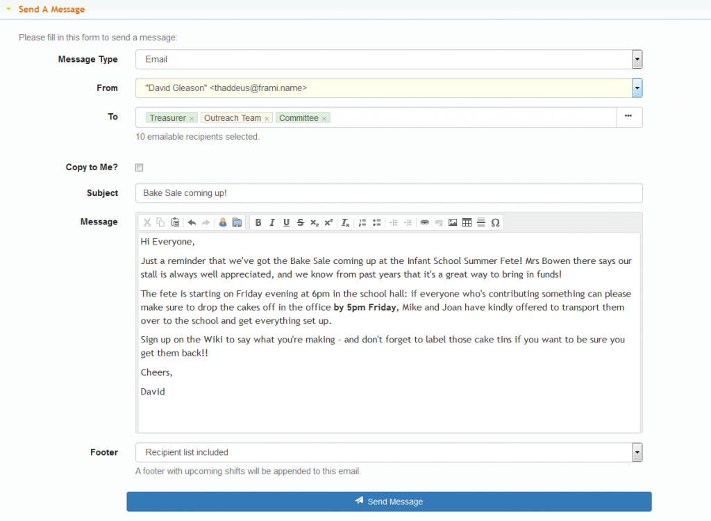

The Comms system allows volunteers within your organisation to communicate with one another by email and (optionally) by text message. Three Rings CIC is not able to sell SMS credits for organisations to use the text messaging system - these must be purchased from a third-party supplier.

- [Writing a message in Comms](../comms/writing-a-message-in-comms/) Selecting recipients and sending Email or SMS
- [Viewing your sent messages in Comms](../comms/viewing-sent-messages/) How to see and delete sent messages on _Three Rings_
- [Setting up SMS Credits](../admin/text-messages/) Configuring Admin\>Text Messages to allow sending SMS messages from Comms
- [Enabling the Comms Tab](../admin/features/) If you've got permission to access Comms and can't see the tab, it may need enabling in Admin\>Features
