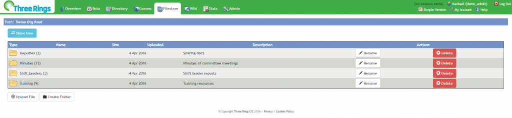

## Filestore

The Filestore provides a secure storage location for your organisations' files: volunteers can upload files to the Filestore, and restrict access on a folder-by-folder basis, limited by volunteers' roles.

- [Navigating the Filestore](../filestore/navigating-the-filestore/) Finding your way around the Filestore, and managing Filestore permissions
- [Working with Files in the Filestore](../filestore/working-with-files-in-the-filestore/) Uploading, Downloading, Renaming, and Deleting files
- [Working with Folders in the Filestore](../filestore/working-with-folders-in-the-filestore/) Information on managing Folders
- [Secrets Store](../filestore/secrets%20store/) Storing secure details like shared passwords or door codes

- [Enabling the Filestore Tab](../admin/features/) If you've got the permissions to View the Filestore and can't see the tab, it may need enabling in Admin\>Features
