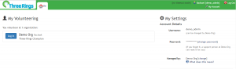

This page summarises the features and options on the **My Account** page. You access the page by clicking on the `My Account` link towards the top right of the screen. 

#### Changing your password

One of the primary uses of the account page is to change your password. There is box on the right-hand side, and one of the links is `Change password`. Click this, and fill in the fields appropriately. Once you've done this, to finish, click `Change password`.

[alert\_box type="info"]If you have a [self-managed account](/help/account/additional-options/), you can also change your name, email address, and username.[/alert\_box]

#### Email Notifications

You can control what emails you get via Email Notifications: click on the `Email notifications options` button to adjust your preferences **The email verification feature** helps us comply with anti-spam legislation, and gives you more control over the emails you receive from organisations you volunteer with. If your email is already verified, you'll see a green box with a tick in it next to your e-mail address in the 'Contact Details' section. If it isn't, this box will be red with a cross in it. To verify your email address, click on this red box or click `Verify my email` in the box under your picture on the right hand side. A box will pop-up, and if you click `Verify my email`, and e-mail will be sent to your e-mail address. To complete the process, go to your e-mail account and click the link in the e-mail address that Three Rings sent you. With a verified email address, you can opt-in to the **Weekly Digest** in the Notifications panel. The Weekly Digest is an automatic email sent from _Three Rings_ which lets you know about any upcoming shifts you have, recent news, and any gaps that you're able to fill.

[alert\_box type="info" class"corners"]The Weekly Digest will show you gaps based on your [Availability and Inactivity settings](https://www.threerings.org.uk/help/help/directory/availability-and-inactivity/), and any other shifts you might be signed up to - it won't show you every gap in the coming week[/alert\_box]

#### System News

System News is information that you'll sometimes see relating to _Three Rings_ itself. We use it to announce new releases, warn you about upcoming downtime, or sometimes provide you with relevant information about what's happening at _Three Rings_. If there's new System News, you'll see it when you log in, and be able to dismiss it. If you never want to see a particular type of System News, you can uncheck the boxes here so that new System News never pops up when you log in.

#### Change my Themes

You can change the colour scheme that _Three Rings_ uses. By default, it will use the same theme as your organisation.

You can configure _Three Rings_ to use either a single theme, or to sync with system:

- A single theme will always apply
- Syncing with system will mean different themes are used when a device is using dark mode

Select a theme from the drop-down menu. You can then click the Preview button to see what that theme will look like. Once you've selected the theme (in single theme mode) or themes (in sync with system mode), click Save Theme Changes for the theme to take affect.

[alert\_box type="success" class="corners"]The available themes include both light and dark high-contrast themes, and a dyslexia-friendly theme that uses the OpenDyslexic font instead of the usual font, which is designed to make text easier to read for people with dyslexia.[/alert\_box]

Alternatively, you can select Create your own Theme from the drop-down menu. This will allow you to set up customised colours.

- [Back to **Account**](../me/)
