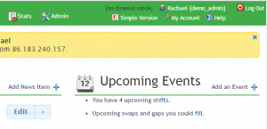

The Events list is tailored to each individual volunteer, and shows the upcoming events at your organisation most relevant to you. It includes your upcoming shifts, events arranged by event administrators, and may also show which volunteers have birthdays in the near future (if this feature has been enabled by an Admin). 

## Adding Events

You can add an Event (as long as you have the right permissions) by clicking on the `Add an Event +` link at the top of the Events listing.

[alert\_box type="info"]You can also add Events from the Rota: click the `+` icon at the top of each day, and select the `Add an event` link in the popup which appears[/alert\_box]

. You can set the Event Title, and give it a Description from the Add Event page. Events can have several different Types, and the Type affects the icon used to display the Event on the Rota. This makes it easier for other volunteers to tell at a glance what the event is likely to be. Possible options include:

- Birthday
- Emergency
- Fundraising
- Generic Event (the default setting)
- Information
- Lecture
- Maintenance
- Meeting
- Outreach
- Phone
- Publicity
- Selection
- Social
- Training
- Travel
- Visitor

## Event Attendance

It's possible to create an Event that volunteers can sign up to. To do this, check the `Attendance list?` box, and optionally set the maximum number of attendees, and an 'RSVP' deadline in the `Attendance closed date` selection box. If the maximum number of attendees is reached before the Attendance closed date, no further signups will be possible. Attendance lists can be either public, or not. Public lists will be visible to anyone with Event View permissions. Private lists will be visible only to volunteers with a Role giving them Event: Manage permissions. Individual volunteers can sign themselves up to an Event's Attendance list, or an event Manager can do this on their behalf. When a volunteer signs up to an Event, they can optionally add a comment, for example _'I'll be there from 19:30'_. Comments will only be visible to the volunteer making the comment, and to volunteers with Event Manage permissions. Once an Attendance List is created, an Event Manager can download the list as a .csv file for editing or printing in an external program. The list will show any additional comments made by attendees.

## Editing and Deleting Events

You can Edit existing events by clicking on them either in the Upcoming Events listing on the Overview, or on the Rota, and clicking the `Edit` button. After making your adjustments, click the `Update Event` button to save your changes. To Delete an Event, click on it either in the Upcoming Events listing or on the Rota, and click the `Delete` button. You will need to confirm you wish to Delete the event in the popup. The Event will then be deleted.

- [Back to **Overview Help**](../../overview/)
