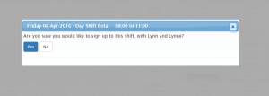

[alert\_box type="info"]Only users with Rota Manage or Self-Manage permissions can manage their own shifts on the rota. It's up to each organisation to set which Roles grant these permissions, and which Rotas you can sign up to - if you're unable to sign up to shifts, contact your organisation's Support People to check your permissions. If you are unsure of who they are, e-mail us and we can pass on a message on your behalf.[/alert\_box]

## Signing Up to Shifts

#### Signing Yourself up for a Shift

To do this, go to the Rota tab and locate the shift that you want to be on. Click the `Sign up` button, and then 'Yes' to accept the shift. 

#### Overriding Unavailability when Signing up for a Shift

If you attempt to sign up for a shift that covers a time when you've said you're unavailable, the system will notify of this. If you're sure you still want to sign up to the shift, click the checkbox and then press the `Sign Up` button.

[alert\_box type="info"]Overriding your unavailability for a single shift won't affect your normal availability settings[/alert\_box]

#### Signing Yourself up for Recurring Shifts

[alert\_box type="info"]If you're not able to sign yourself up for recurring shifts, _Three Rings_ won't show this option[/alert\_box]

Find the shift you want to sign up to and click `Sign up`. On the pop-up that appears, tick the check box for the option `Sign up to a series of recurring shifts`. click yes, and you'll be taken to another screen which displays all of the shifts in the series. Click the tick boxes next to the shifts you want to sign up to, and then click `Sign up`.

## Swapping Shifts

#### Allowing another Volunteer to Swap into a Shift

This will allow another volunteer to do a shift instead of you. If no-one chooses to swap into the shift, **you will still be signed up**. Swapping is one-way: someone may swap into your shift, but you're won't be automatically signed up to do one of their shifts.

[alert\_box type="info"]You can only allow someone else to swap into your shift the option has been turned on by an Admin in Admin\>Features, and allowed by the rules for that Rota.[/alert\_box]

Find the shift that you want another volunteer to swap into, and click on your name. Click on the option, `Allow another volunteer to swap into this shift` in the popup box. If you change your mind about letting other volunteers swapping into a shift, you can cancel the Swap request, by clicking on the option `Stop allowing other volunteers to swap into this shift`, instead.

#### Swapping into Someone else's Shift

Find a shift that has a yellow double-arrow symbol next to a person's name. Click on their name, and on the following pop-up box, click `Sign up, replacing (name)`. You will then replace the original volunteer on the Rota for that shift.

## Pulling out of a Shift

To pull out of a shift, find the shift you no longer wish to do, click click on your name, and then on `Pull out of shift`. Your name will be removed from the rota for that shift.

[alert\_box type="info"]If you're not able to pull out of a shift, it's probably because your local Admins have restricted your ability to pull out of certain shifts (for example, shifts that would be happening soon. In this case, you should ask your local Support People for help.[/alert\_box]

- [Back to **Rota Help**](../../rota/)
