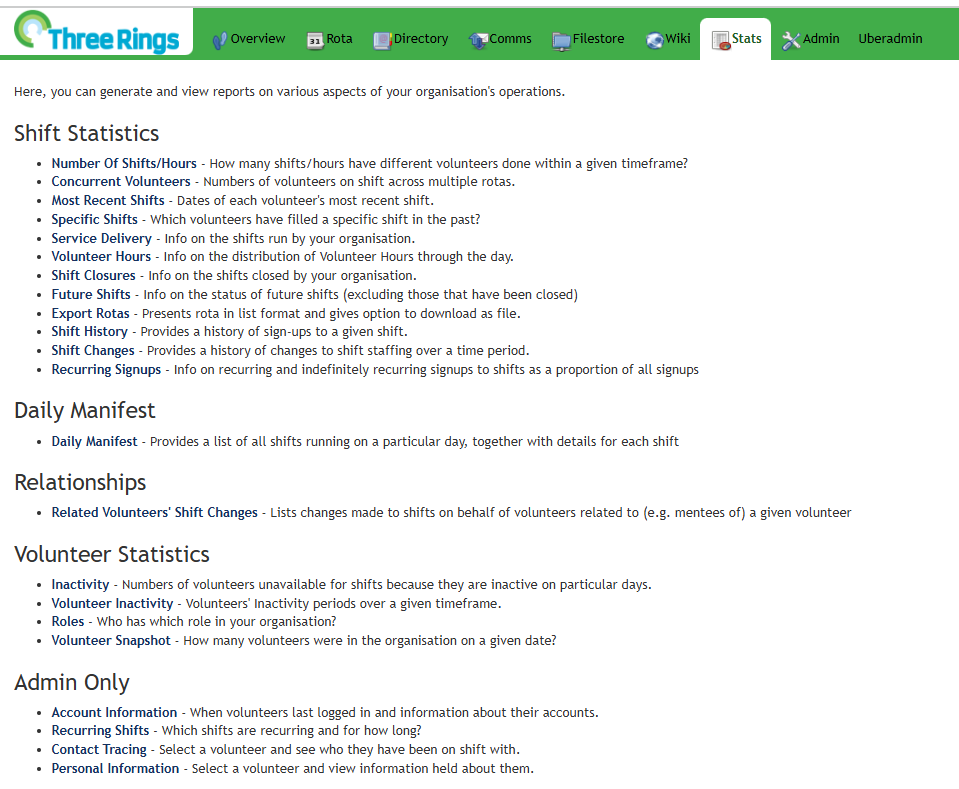

The Stats function allows you to track volunteers shifts, service coverage, and volunteer availability. You can access the Stats page by clicking on the `Stats` tab at the top of the page.

Once you are on the Stats page, you will be offered a variety of reports as listed below. The help pages provide further detail on these options.

- [Number of Shifts/Points/Hours](../stats/number-of-shiftshourspoints/) Reporting on how many hours or shifts your volunteers have done
- [Most Recent Shifts, Specific Shifts, and Service Delivery](../stats/recent-and-specific-shifts-and-service-delivery/) Finding volunteers' last shifts, who covered specific shifts, and how many shifts have been run
- [Shift Closures, Future Shifts, Shift History, and Shift Changes](../stats/shift-closures-gaps-and-shift-history/) Statistics on when shifts have been closed, Unfilled shifts, and each shift's History and Changes
- [Availability, Inactivity, and Volunteer Inactivity](../stats/availability-inactivity-and-volunteer-inactivity/) All shifts that are neither fully-staffed or closed

- [Export Rotas, Roles, and Volunteer Snapshot](../stats/export-rotas-and-last-login/) Exporting specific Rotas to edit in external programs, Who has what Roles, and report on how many volunteer accounts there were in the past
- [Concurrent Volunteers, Volunteer hours, and Daily Manifest](../stats/volunteers-hours-concurrent-manifest/) Shows how many volunteers are on duty at the same time, shows volunteers by hour of day, and shows who is on duty on a particular day
- [Account Information, Recurring Shifts, Contact Tracing, and Personal Information](../stats/admin-reports/) Details of accounts, recurring shifts, who has been on duty with whom and Information held on a volunteer (only available to Administrators)
