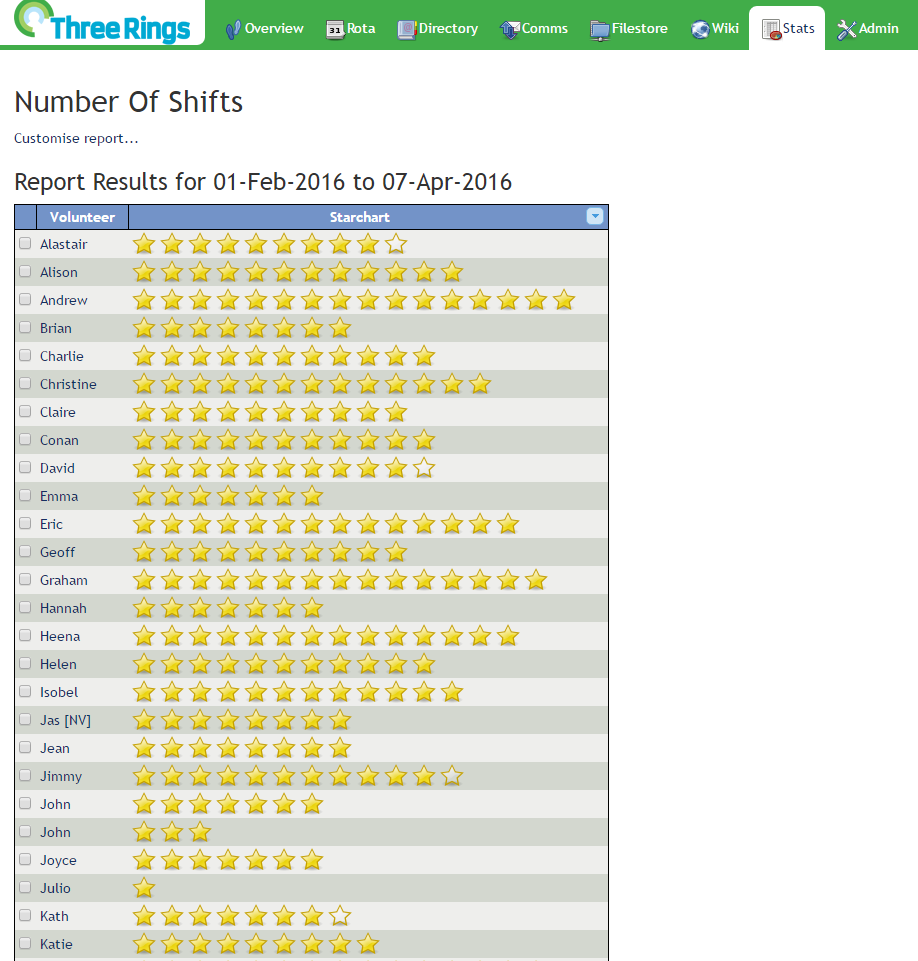

The 'Number of Shifts/Hours/Points' option allows you to generate reports on the number of shifts, and how many hours or points those shifts represent, that specific volunteers have undertaken in a given time period. To generate a report, click the `Stats` tab at the top of the page, and then the `Number of Shifts/Points/Hours` link.

#### Volunteers

Specify which groups of volunteers to generate the report for, either by Volunteer categories, or by Role: From the `Volunteers` dropdown box, you can select either `All volunteers`, `All awake volunteers`, or `All asleep volunteers`.

Alternatively, you can change the `With role` dropdown to Select roles... and use the checkboxes to run the report against either `Everyone (any role or roles)` or a Specific role or Roles from the list.

You can also include volunteers' Inactivity data (by Inactivity type), and any Directory property from the _Directory As List_ view which your Role permits you to see. To do this, tick the appropriate Checkbox when running the report.

#### Shifts

You can use the the `Rota` dropdown box to select a specific rota, `All rotas`, or `Multiple rotas...`. If you select `Multiple rotas...`, choose which Rotas to run the search against using the checkboxes. You'll also be able to view the results for each Rota separately if you want.

#### Date

Click on the `edit` boxes to make a calendar appear. Use it to select the date of the event. Click on the right arrow to move the calendar forward one month at a time, and click on the left arrow to move it back one month at a time.

#### Output

Lastly, you can specify what data you want reported, and in what format: either `Number of shifts`, `List of shifts` (listing shifts each volunteer has staffed), `Startchart of shifts`, `Number of hours` or `Number of points`.

[alert\_box type="info"]Points will not be included in this list if they are turned off for your organisation in `Admin > Features`[/alert\_box]

From the `Format` dropdown, you can select how the report will be displayed, either as a Web Page, or other formats suitable for printing and export with external programs. ****

#### Generating, viewing, and editing the report

To display the report, click the `Generate Report` button

[alert\_box type="info"]If you selected the 'Web page' format option, you can sort the results by clicking on the title of the column you want to sort the data by.[/alert\_box]

If you want to edit any of the options you set for the report, then click the `Customise report...` link at the top of the page.

#### Sending messages based on reports

You can message volunteers directly from the - for example, if you want to email everybody who has done more than a certain number or hour of shifts. To do this, generate a report as set out above and sort the results as you wish, check the volunteers you want to message, and then click `Send Email` or `Send SMS`: you'll be taken to Comms where you can write and send your message.

- [Back to **Stats Help**](../../stats/)
