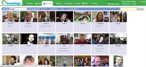
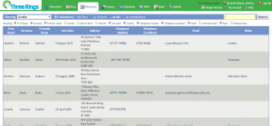

Directory view is accessed by clicking the Directory tab located at the top of any _Three Rings_ page. The Directory view is used to find volunteers within your organisation.

### Viewing the Directory as Buttons or as a List

The Directory can be viewed in two ways, as 'Buttons' and as a 'List'. The default option is `... as buttons.`

#### 

#### Viewing as Buttons

When the Directory is set to show as Buttons, each volunteer will be given a Button that displays their photo (or a default outline if no photo is uploaded), their name, and any Roles they have. If the default view has been changed, you can view volunteers as Buttons by clicking the `...as list` link near the top of the directory view page.  **Viewing volunteers as a List** When the Directory is set to show as List, each volunteer will be presented on a separate line, with different columns showing information relating to that volunteer. The columns displayed will depend on how _Three Rings_ has been set up in your organisation. To view volunteers as a list, click the `...as list` link near the top of the Directory view page. 

#### Sending Messages from List View

When viewing the Directory in list view, volunteers with a Role that gives them Comms permissions can select volunteers from the list to send them a message by email or SMS (assuming your organisation is set up for SMS messaging). To do this, check the boxes for each volunteer you want to include in the message, and then click either the `Send Email` or `Send SMS` button at the foot of the page. You will be taken to the Comms page, [where you can compose your message as normal](https://www.threerings.org.uk/help/help/comms/writing-a-message-in-comms/).

#### Customising List View

If the information you wished to view about volunteers is not displayed by default, list view can be customised using the check boxes at the top of the page. Check the boxes of fields you want to be displayed, and uncheck the boxes of those fields you do not wish to view at this time.

#### Setting a Custom List View as Default

If you have customised the list view as described above, a button will appear near the check boxes at the top of the screen labelled . Clicking this button will save the current directory view as the default view for the current user. This means that every time this user chooses to view the directory as a list, this is the layout they will be presented with (until the default is changed again).

#### Viewing Volunteers as a Spreadsheet

If you want to export the volunteer data from _Three Rings_ in order to gain access to it offline, or to manipulate it in other application, this can be done by choosing the view volunteers as a spreadsheet. Click `...as a spreadsheet` near the top of the page. You will be prompted to select a file format to download.

[alert\_box type="info" class="corners"] If you want to combine information from the Directory with information from the Number of Shifts report in the Stats function, you may want to enable a unique identifier property in Admin \> Properties and include this as a column in your spreadsheet.[/alert\_box]

#### 

### Finding Specific Volunteers

#### Finding Volunteers by Name

Volunteers are normally listed in alphabetical order by name. The simplest way to find a volunteer is to scroll through the directory pages until you find them. If the volunteer directory for your organisation covers more than one page, then you may need to use the page navigation tools to locate some volunteers. The grey number indicates the current page, the highlighted numbers indicates pages that can be jumped to. The `Next` button will automatically take you to the next sequentially numbered page when clicked.

#### Filtering Volunteers

If your organisation has a lot of volunteers, it can be easier to filter the directory view when looking for particular volunteers. To do this, locate the drop-down box near the top of the page. Click on the drop-down box to produce the list of filtering possibilities and click on the desired filtering option. The directory view will then automatically update to display only volunteers who reflect the filter requirements.

[alert\_box type="info" class="corners"] To change the filter back to normal, click on the Directory tab (your filtered selection is not retained). [/alert\_box]

#### Searching for Volunteers

You can search for a specific volunteer using the search box at the top right of the Directory page: enter all or part of their name, click the search button, and then pick the volunteer you want from the search results. To return your view to normal, select Awake from the drop-down box near the top of the page , or click on the Directory tab.

- [Back to **Directory Help**](../directory/)
